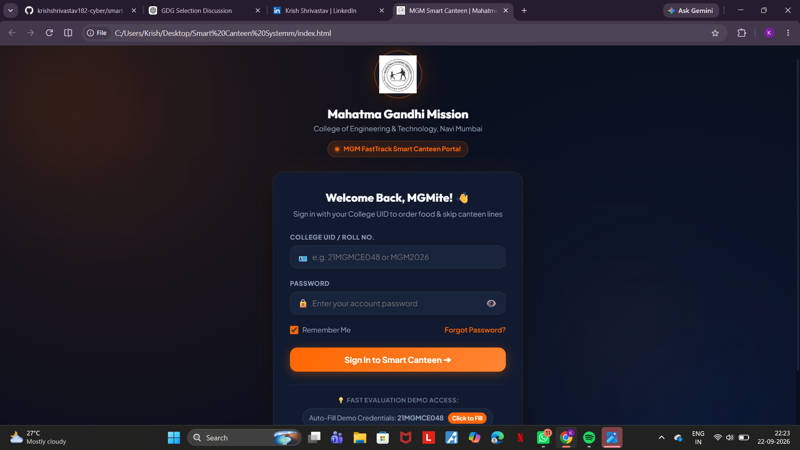

# 🍽️ MGM Smart Canteen System

A smart digital canteen portal designed for students of MGM College of Engineering & Technology, Navi Mumbai. The system helps students order food conveniently and reduce waiting time at the college canteen.

## 🚀 Features

- 🔐 Student Login using College UID / Roll Number
- 🛒 Online food ordering
- ⚡ Fast and convenient ordering experience
- 🔑 Password and account recovery
- ☑️ Remember Me functionality
- 🧪 Demo access for evaluation
- 📱 Student-friendly interface

## 🛠️ Technologies Used

- HTML5
- CSS3
- JavaScript

## 📸 Screenshot

### Login Page



## ⚙️ How to Run

1. Download or clone this repository.
2. Open the project folder.
3. Open `index.html` in a web browser.
4. The Smart Canteen portal will launch.

## 📂 Project Structure

```text
Smart Canteen System/
├── css/
├── js/
├── Public/
├── screenshots/
│   └── login.png
├── index.html
└── README.md
